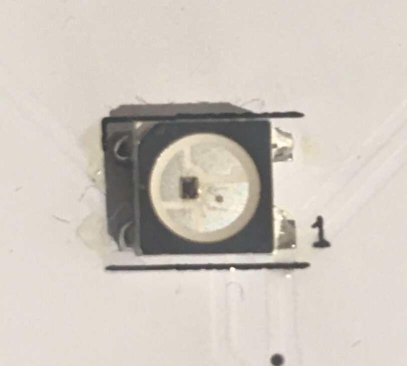

# Púca Build Guide

## Contents

- Required Parts
- Getting Started
- OLED
- ProMicro
- Reset Switch
- Testing before continuing
- Diode
- OLED
- Hotswap Sockets

## Required Parts

Below are a list of all parts for building a Púca Pad. Optional items are listed separately.

### Required
| Name            | Quantity     |
|-----------------|--------------|
| PCB             | 1            |
| Diodes          | 23           |
| Reset Switch    | 1            |
| Pro Micro  / Elite-C     | 1          |
| Rotary Encoder  | 1            |
| Plate Botton    | 1            |
| Plate Top       | 1            |
| Acrylic Guard   | 1            |
| Standoffs and screws    | ......            |

### Optional
| Name            | Quantity     |
|-----------------|--------------|
| OLED Module     | 1            |
| WS2821B LED's   | 8            | 

## Getting Started
Assuming you have all of the required parts listed above, you can start the process of building your Púca. 

The PCB for v1.3 is not reversible, which means that it must be used in its correct orientation. The correct layout can be seen below, but is essentially the side with the diodes and the Púca logo on the right.

<Insert image of Púca PCB orientation>

## OLED

If you intend on using the supplied OLED display with your Púca, then you will need to bridge four pads. These pads are located under the pro-micro, so it is recommended to bridge these first. Apply solder to one side of the pad and then drag across to the other, the finished product should look as follows:

<Insert image of bridged OLED pads>
  
  
## Pro Micro / Elite-C
  
We will begin by soldering the microcontroller. We perform this now to ensure that the PCB and controller are functioning correctly, which will also help narrow the cause of any issues that could potentially occur here: most commonly due to incorrect soldering.
  
Next, we will solder the ProMicro in place. This can be made hotswap using either millmax sockets or a ProMicro hotswap socket kit and either pins or diode legs. For this guide, we will assume that you have the Púca base kit, and will use parts available from there. Place the pins into the PCB as seen below:

<Insert image of pins placed into PCB>
  
We will then solder these in place. It is recommended to use a small piece of masking tape to hole the pins in place during this process to ensure it is kept flat.
  
<Insert image of tape over pins>
  
Next, place your pro-micro / elite-c **face down**. The orientation here is extremely important for two reasons; Firstly, this provides a lower profile which allow the OLED and acrylic guard to be placed closer to the PCB. Secondly, it just won't work due to the pad placement. Make sure the orientation is correct, with the components facing downward, and the back of the pro-micro PCB visible. It should look like the image below:
  
<Insert image of correct mcu placement>

Then apply solder to each of the pins poking through the pro-micro. Ensure the solder provides a clean and solid connection, as seen below:
  
<Insert image of properly soldered ProMicro>
  
Desoldering a ProMicro is not an experience I would recommend.
  

  
  
## Reset Switch
  
Next, we will solder the reset switch in place so that we can flash firmware to the board. The orientation is not important here, see below:
  
<Insert image of reset switch soldered>
  
  
## Testing before continuing

It is highly recommend to stop at this point and test that everything is working correctly. Desoldering components is not as easy as installing them, and troubleshooting at this stage is far easier than if all components have been installed.
  
Begin by plugging your Púca into your PC / laptop with an appropriate cable. If you haven't already download the Púca firmware file. Then open QMK Toolbox, select the Púca Firmware file from the dropdown menu and press your reset switch. This should auto-detect in QMK Toolbox, and allow you to click 'flash'. Some output will be displayed on screen, and you will be prompted once complete.
  
If the above steps complete without issue, then everything is working correctly so far. We will test each stage throughout the build process to identify issues as early as possible.
  
  
## Diodes

Now we will start with the diodes. These will be on display on the right side of the PCB. The orientation here is important as a diode will only allow current to pass in one direction, placing it in the opposite direction will stop the current from passing from the switch to the ProMicro, and will result in the associated key not working. The PCB has a line on the north edge of the diode which represents the cathode end, this should match the line on the diode. The correct orientation can be seen below:
  
<Insert image of correct diode orientation>
  
You can do these individually if you wish, or row-by-row. For the purpose of this guide they will be done row-by-row.
  
Place the leg of the anode end of the diode into the PCB, and bend 90 degrees to it will sit centrally. An example of this can be seen below:

<Insert image of diode with single bend>
  
Now, take note of roughly how far it is before the next bend, remove the diode and bend by hand. Place back into the PCB, and if done correctly, should sit flush against the PCB. The diode legs on the back of the PCB can be bent to hold the diode in place, seen below:
  
<Insert image of bent diode legs on back of PCB>

Repeat this process for each of the 23 required diodes, ensuring that there is a strong connection and the orientation is correct. If you plan on using the OLED display skip ahead to the section: OLED (Optional). If not, we will test the diodes now. 

Carefully plug the ProMicro in and either open Vial or your key tester of choice. Vial will be used for remapping the keys with a GUI later on. Using a pair of tweezers, touch each of the pads on the bottom of the PCB. This will simulate a key press, and if the diode's have been soldered correctly should register on screen for you. If a key does not register here follow the steps in the Troubleshooting section at the end.

## OLED (Optional)

This is an optional item, however if you are intending on using the OLED it can be attached now. Place the OLED into position over the ProMicro and solder the four legs into position.

<Insert soldered OLED image>
  
We will then test to make sure the OLED is working correctly. Simply plug the Púca in and the OLED should automatically power on, displaying the Púca ghost and layer information. If you did not test the diodes in the previous step, then we will do this now.

Carefully plug the ProMicro in and either open Vial or your key tester of choice. Vial will be used for remapping the keys with a GUI later on. Using a pair of tweezers, touch each of the pads on the bottom of the PCB. This will simulate a key press, and if the diode's have been soldered correctly should register on screen for you. If a key does not register here follow the steps in the Troubleshooting section at the end.
  

## Hotswap Sockets

Púca uses kailh sockets to provide the hotswap feature, and are required for this build. These are to be soldered to the bottom of the PCB, the opposite side of where the ProMicro and diodes are currently sitting. To solder the sockets in place first put a small amount of solder on one of the pads as seen in the example below:

<Insert pre-solder kailh socket image>

The purpose of this is that we will reflow this connection to hold the socket in place. Next, place the hot-swap socket into the PCB and make sure it is firmly pressed against the PCB, it is important to make sure these are as flat as possible so the switch pins can fit in correctly. Next, reheat the solder that was placed on the pad whilst pressing the hotswap socket against the board with tweezers (this can also be done by hand, but be very careful not to burn yourself). This will cause the solder to flow again, and create a connection with the socket.

Add a small amount of more solder onto the top of socket pressing against the pad to ensure a proper connection. Repeat this step for the other side so that both ends of the socket now have proper connections, example of how this should look below:

<Insert finished soldered socket image>

 
## Rotary Encoder

  

## Underglow LED's (Optional)

This is an optional step and is only required if you wish to have underglow lighting on your Púca. To do this, simply solder the eight SMD LED's into their pads, taking note of the orientation of the LED. One of the corners has a triangle / is tabbed, and should be in the **opposite** corner to where you see the number one, see image below:
  

Again, note the orientation and see that the tabbed corner opposite to the number one. All eight of the LED's are linked in sequence, so if one of them is soldered incorrectly, everything after will also fail to work. 

## Troubleshooting

### Key presses not registering
  
This can be down to one of three common causes.
1) Diode is in the wrong orientation
2) ProMicro does not have a strong soldered connection to the PCB
3) Switch legs are not sitting in the hotswap socket correctly 
